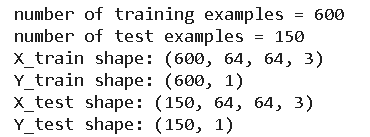

# Detect Object Happy Or Not by using CNN
# singer objects

## 1. Connect Google Drive and Access folder
```python:
    from google.colab import drive
    drive.mount('/content/gdrive')
    %cd /content/gdrive/My\ Drive
```


## 2. Code function utils using for Train and Test Model
```python:
    import keras.backend as K
    import math
    import numpy as np
    import h5py
    import matplotlib.pyplot as plt
    
def mean_pred(y_true, y_pred):
    return K.mean(y_pred)

def load_dataset():
    train_dataset = h5py.File('datasets/train_happy.h5', "r")
    train_set_x_orig = np.array(train_dataset["train_set_x"][:]) # your train set features
    train_set_y_orig = np.array(train_dataset["train_set_y"][:]) # your train set labels

    test_dataset = h5py.File('datasets/test_happy.h5', "r")
    test_set_x_orig = np.array(test_dataset["test_set_x"][:]) # your test set features
    test_set_y_orig = np.array(test_dataset["test_set_y"][:]) # your test set labels

    classes = np.array(test_dataset["list_classes"][:]) # the list of classes
    
    train_set_y_orig = train_set_y_orig.reshape((1, train_set_y_orig.shape[0]))
    test_set_y_orig = test_set_y_orig.reshape((1, test_set_y_orig.shape[0]))
    
    return train_set_x_orig, train_set_y_orig, test_set_x_orig, test_set_y_orig, classes
```
Warning : **The path to the data set must be correct**
<p align="center" width="100%">
     
</p>
## 3. Code create Model and test Model
```python:
#Step1: Import Library Necessary
    #load the required packages
    import numpy as np
    from keras import layers
    from keras.layers import Input, Dense, Activation, ZeroPadding2D, BatchNormalization, Flatten, Conv2D
    from keras.layers import AveragePooling2D, MaxPooling2D, Dropout, GlobalMaxPooling2D, GlobalAveragePooling2D
    from keras.models import Model
    from keras.preprocessing import image
    from keras.utils import layer_utils
    from keras.utils.data_utils import get_file
    from keras.applications.imagenet_utils import preprocess_input
    import pydot
    from IPython.display import SVG
    from keras.utils.vis_utils import model_to_dot
    from keras.utils import plot_model
    from kt_utils import *

    import keras.backend as K
    K.set_image_data_format('channels_last')
    import matplotlib.pyplot as plt
    from matplotlib.pyplot import imshow
    %matplotlib inline
    
#Step2: Preprocessing Data set
    #Normalize the dataset
    X_train_orig,Y_train_orig, X_test_orig, Y_test_orig, classes= load_dataset()
    X_train = X_train_orig/255.
    X_test = X_test_orig/255.
    # Reshape
    Y_train = Y_train_orig.T
    Y_test = Y_test_orig.T

    print ("number of training examples = " + str(X_train.shape[0]))
    print ("number of test examples = " + str(X_test.shape[0]))
    print ("X_train shape: " + str(X_train.shape))
    print ("Y_train shape: " + str(Y_train.shape))
    print ("X_test shape: " + str(X_test.shape))
    print ("Y_test shape: " + str(Y_test.shape))

#Step3: Create Model Emptry
def HappyModel(input_shape):
    X_input= Input(input_shape)    
    X= ZeroPadding2D((3,3))(X_input)
    X= Conv2D(32,(7,7),strides=(1,1),name= 'conv0')(X)
    X= BatchNormalization(axis=3,name='bn0')(X)
    X= Activation('relu')(X)
    X= MaxPooling2D((2,2),name='pool1')(X)
    X= Flatten()(X)
    X= Dense(1,activation='sigmoid',name='fc')(X)
    model= Model(input=X_input,outputs=X,name='HappyModel')
return model

#Step4: Create Model Happy and Evaluate Model on the Test_data
    happyModel = HappyModel(X_train.shape[1:])   #except the number of example 
    #compile the model
    happyModel.compile(optimizer='adam',loss='binary_crossentropy',metrics=["accuracy"])

    #train the model
    happyModel.fit(X_train,Y_train,epochs=40,batch_size=64)

    #evaluate model use test file
    preds = happyModel.evaluate(X_test,Y_test,batch_size=32,verbose=1, sample_weight=None)
    print()
    print ("Loss = " + str(preds[0]))
    print ("Test Accuracy = " + str(preds[1]))

#Step5:  Try with read Data
    img_path = 'images/smile.jpg'
    img = image.load_img(img_path, target_size=(64, 64))
    imshow(img)

    x = image.img_to_array(img)
    x = np.expand_dims(x, axis=0)
    x = preprocess_input(x)

    if (happyModel.predict(x)==1):
        print ("\nHe is very funny")
    else:
        print ("\nHe don't funny")

    #prints the details of my layers in a table with the size of its inputs/outputs
    happyModel.summary()

    #plots my graph in a nice layout. You can save it as ".png" using SVG(). It is saved in "File" then "Open " it upper
    plot_model(happyModel, to_file='HappyModel.png')
    SVG(model_to_dot(happyModel).create(prog='dot', format='svg'))
```

## 4. Result
### 4.1 Image input
<p align="center" width="100%">
     
</p>
### 4.2 Output

